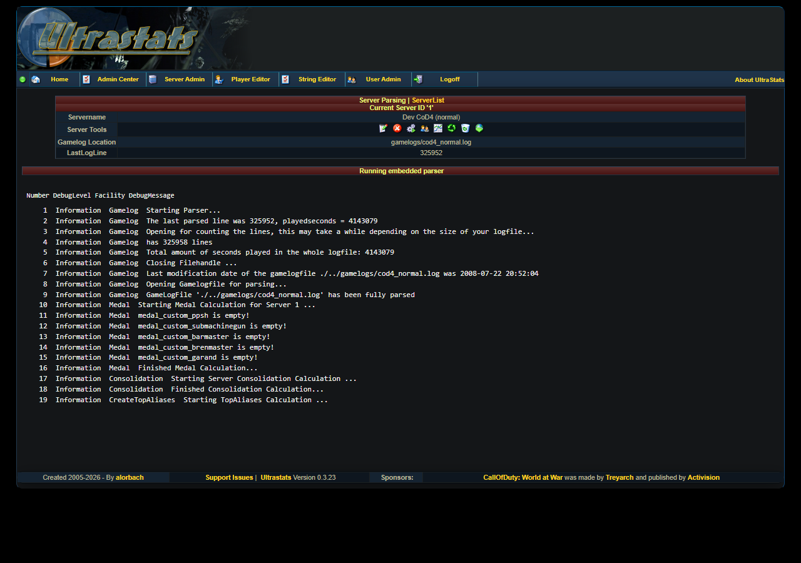
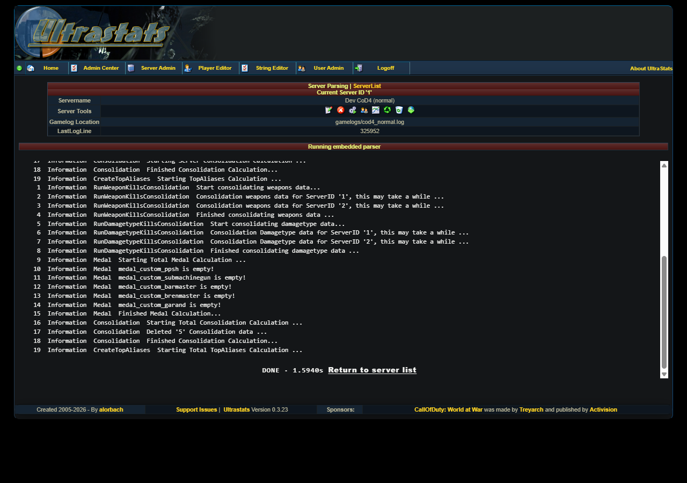
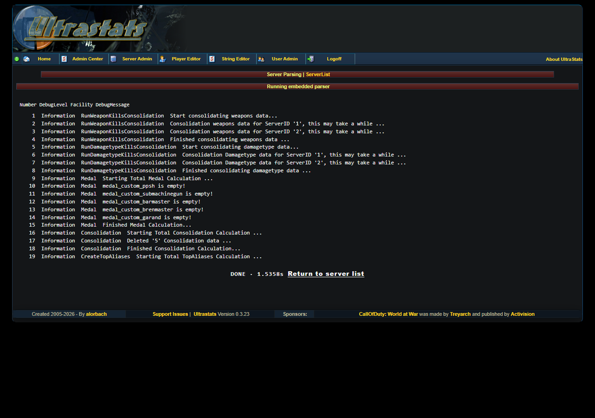
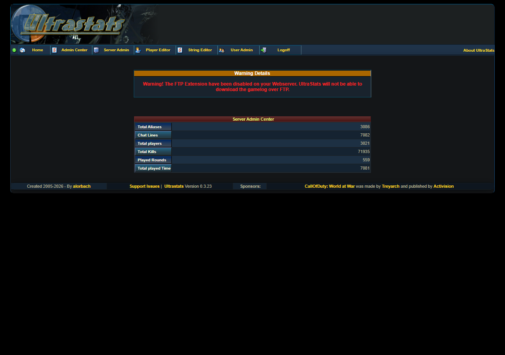

# Process gamelogs and check results

The parser reads the configured **GameLogLocation** for a server and writes player, round, weapon, chat, alias, and summary data into the database. Relative gamelog paths are resolved from the deployed UltraStats app root, which is normally the uploaded contents of `src/`.

## Run the parser

1. Sign in to the Admin Center.
2. Open **Server Admin**.
3. In the server row, click the gears icon for **Run Parser**.

The embedded parser page shows the current server, the configured gamelog path, the saved **LastLogLine**, a live log area, and a cancel button.

When the parser reaches the end of the log, the page shows a **DONE** banner and a link back to the server list.

## Run total calculations

After importing one or more logs, run **Run Total/Final Calculations** from **Server Admin** under **Additional Functions**.

This consolidates server stats, damage type kills, weapon kills, aliases, and medal data used by the public pages.

Use **Create top aliases** when you only need to rebuild alias summaries. Use the full total update after a fresh import, a reparse, or a delete/reimport cycle.

## Check database statistics

Back on **Server Admin**, click the line-chart icon for **Server DB Statistics**. The page shows row counts for aliases, chat lines, players, kills, rounds, and played time.

Then check the public pages:

- **Players**
- **Rounds**
- **Weapons**
- **Server Stats**

If those pages are empty, confirm that the server is enabled, parsing is enabled, the log path is correct, and total calculations have run.

## Reprocess a log

Use reprocess tools carefully:

- **Reset Last Logline to 0** makes the next parser run read the log from the beginning.
- **Delete server stats** removes imported stats for that server.
- **Delete server** removes the server entry and its stats.

These actions are destructive and show confirmation prompts. For older data that was imported before parser fixes, the usual recovery path is: reset last logline, re-run the parser, then run **Run Total/Final Calculations**.

## Technical details

For proxy buffering, Server-Sent Events behavior, cancel behavior, and classic parser fallback notes, see [Admin, parser, and live log (SSE)](admin-parser.md).
