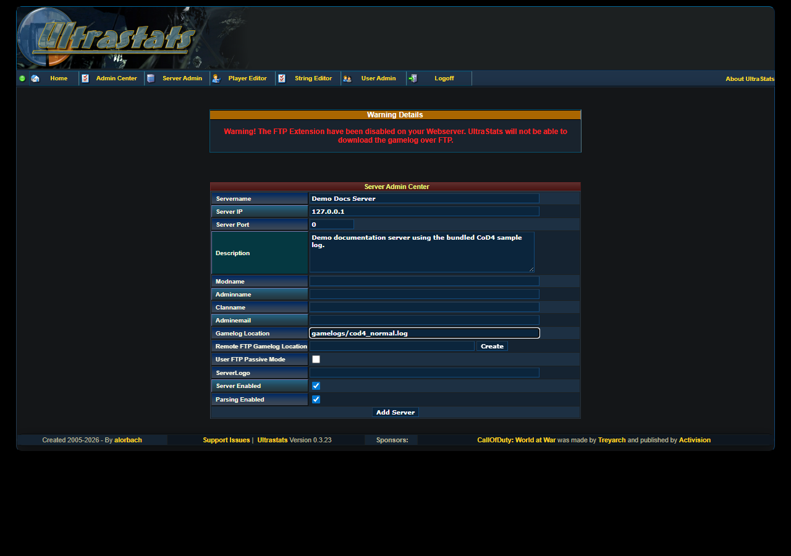

# Add or edit a server

Use **Server Admin** to tell UltraStats where a game server log lives and whether that server should appear in the public stats.

## Open the server form

1. Sign in to the Admin Center.
2. Open **Server Admin**.
3. Click **Add Server** to create a new row, or use the edit icon on an existing server.

For the Docker demo, you can inspect the seeded `Dev CoD4 (normal)` and `Dev CoD4 (HQ new)` rows instead of saving a new server.

## Required fields

The important fields are:

| Field | Demo value | Notes |
|-------|------------|-------|
| **Servername** | `Demo Docs Server` | Display name in UltraStats. |
| **Server IP** | `127.0.0.1` | Informational for the local demo. |
| **Server Port** | `0` | The demo seed also uses `0`. Use the real game port for live servers. |
| **GameLogLocation** | `gamelogs/cod4_normal.log` | Path readable by the web server, relative to the deployed UltraStats app root. |
| **Server Enabled** | checked | Shows the server in the public UI. |
| **ParsingEnabled** | checked | Allows parser operations for the server. |

## Local paths and FTP

For local Docker, the repository's `src/` directory is mounted as the web root, so files under `src/gamelogs/` are entered in the form as `gamelogs/...`. For a production install, users normally upload only the contents of `src/`; the path still starts from that deployed app root, not from the repository root.

If the web server must download the log from a remote game server, fill **Remote GameLogLocation** or use the FTP builder after the server exists. Local demo parsing does not require FTP.

## Save and return

After saving, UltraStats returns to the server list. The new row should expose the same action icons as the seeded demo rows: edit, delete, **Run Parser**, create aliases, **Server DB Statistics**, reset last logline, delete stats, and get new logfile.

Continue with [Process gamelogs and check results](admin-center-parser.md).
