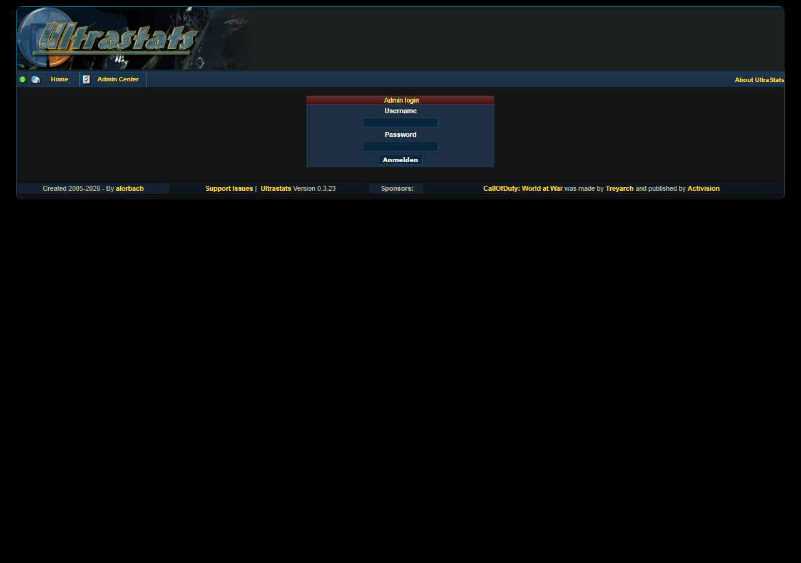
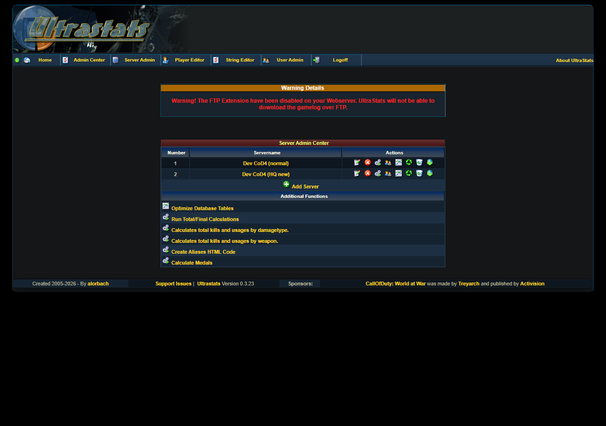

# Admin Center guide

The **Admin Center** is where you configure servers, run the parser, and check whether UltraStats has imported data from your game logs.

These screenshots use the local Docker demo at **http://localhost:8091/**. The demo seed creates two sample CoD4 servers and a local-only admin user:

- Username: `admin`
- Password: `pass`

Do not use this password on a shared or production installation.

For normal web hosting, deploy only the contents of `src/`. In the Admin Center, paths such as `gamelogs/cod4_normal.log` are relative to that deployed app root, the directory that contains `index.php`, `admin/`, `include/`, and `gamelogs/`.

## Core workflow

1. Open **Admin Center** and sign in.
2. Go to **Server Admin**.
3. Add a new server, or edit one of the Docker demo servers.
4. Run the parser for that server.
5. Run **Run Total/Final Calculations**.
6. Check **Server DB Statistics** and the public stats pages.

## Demo servers

The Docker demo already registers two enabled sample servers:

| Server | Gamelog |
|--------|---------|
| `Dev CoD4 (normal)` | `gamelogs/cod4_normal.log` |
| `Dev CoD4 (HQ new)` | `gamelogs/cod4_hq_new.log` |

You can use those rows directly for parser tests. If you want to learn the server form first, follow [Add or edit a server](admin-center-server.md) and fill the form without saving, or save only in a disposable local demo database.

## Next steps

- [Add or edit a server](admin-center-server.md)
- [Process gamelogs and check results](admin-center-parser.md)
- [Parser technical notes: SSE, proxies, cancel](admin-parser.md)
