# Install (bundled static doc)

Here is **historical** help for installing UltraStats. **Current** requirements (PHP 7.4+, MySQL 8, Docker) and paths are in the root [README.md](../../README.md) and [AGENTS.md](../../AGENTS.md). (A legacy repository-root `INSTALL` file without an extension is kept for packaging habits only; the maintained install text is in **this** Markdown file and in the [handbook](https://alorbach.github.io/ultrastats/).)

---

You will need:

- Apache or IIS web server  
- PHP (modern installs: **PHP 7.4+**; the original text mentioned PHP 5)  
- MySQL or compatible database  
- A game log from a Call of Duty 1 / UO / 2 / 4 / WaW server  

## Server log configuration

Your game server must produce a log file. For known Call of Duty versions, these settings are recommended in the **server configuration**:

```text
set logfile "1"         // 0 = no log, 1 = log file enabled
set g_logsync "2"       // 0=no log, 1=buffered, 2=continuous, 3=append
set g_log "games_mp.log"  // name of the log file
```

For **Call of Duty 4** workarounds, this line is also recommended:

```text
set sv_log_damage "1"   // enables damage logging
```

## Upload and permissions

1. Upload the **contents of `ultrastats/src/`** to the web server document root (or to the UltraStats subdirectory you want to serve). Do not upload the repository root as the public web root. The deployed app root is the directory that contains `index.php`, `admin/`, `include/`, `contrib/`, and `gamelogs/`.  
2. If the web server can write the deployed app root, you can skip the shell step; otherwise, from the deployed **`contrib/`** folder, copy `configure.sh` and `secure.sh` next to the install, `chmod +x` them, and run `./configure.sh` to create a blank `config.php` with world-writable permissions (or do the same manually).  
3. Open the site in a browser. You should be prompted toward the **installation wizard**—follow it.  

### Installer steps (summary)

- **Step 1 — Welcome** — confirms prerequisites.  
- **Step 2 — File permissions** — ensure `config.php` can be written; fix permissions and re-check if needed.  
- **Step 3 — Database** — host, port, database name (create the empty database first), table prefix, user, password, and **game version** (one CoD version per installation).  
- **Step 4 — Create tables** — runs schema import. **Warning:** an existing install with the **same** table prefix will be **overwritten**.  
- **Step 5 — SQL results** — confirms statements ran.  
- **Step 6 — First admin user** — create the initial admin account.  
- **Step 7 — Done** — installation complete.  

### Installer walkthrough (screenshots from testbench run)

The latest local testbench capture is in:

- `_tmp/install-e2e-reports/install-e2e-report/index.html`

Step images used below are from:

- `_tmp/install-e2e-reports/install-e2e-report/screenshots/step-01.png` to `step-14.png`

#### Wizard pages (1–7)

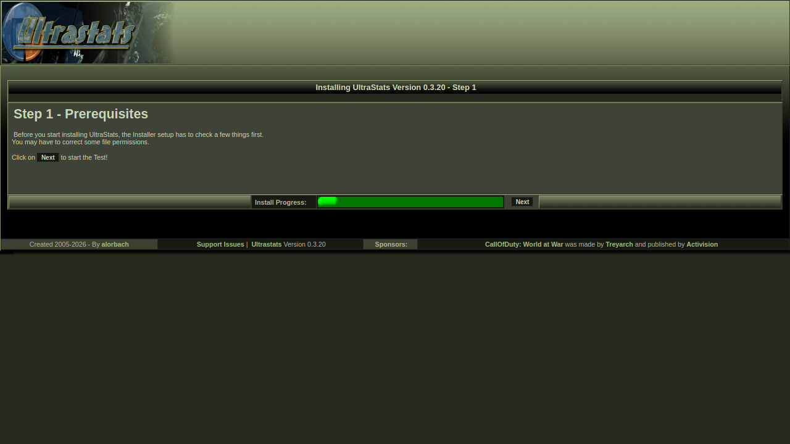
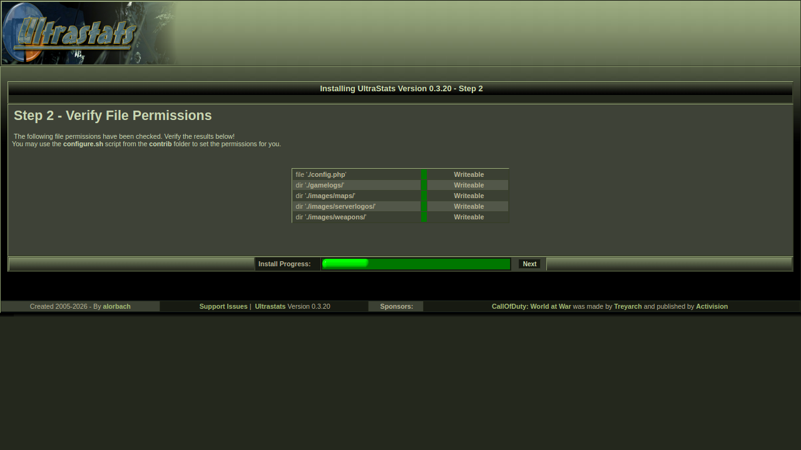
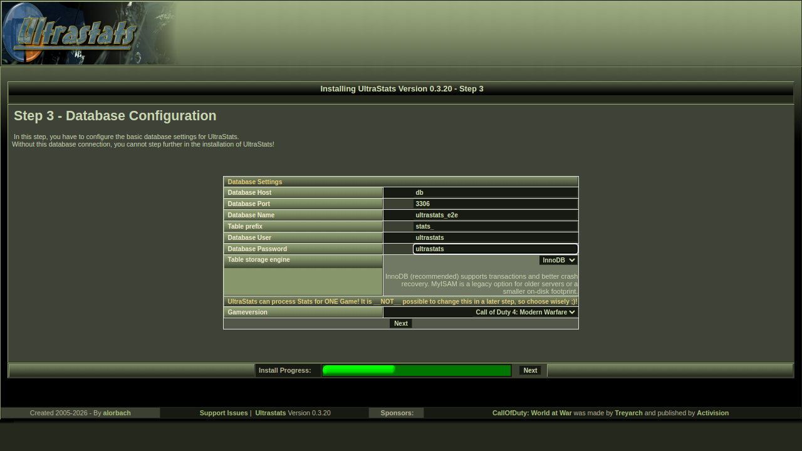
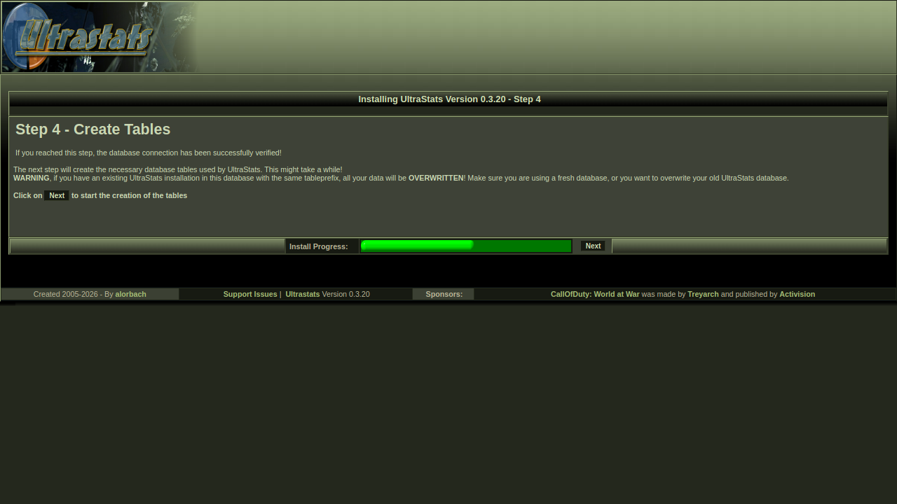
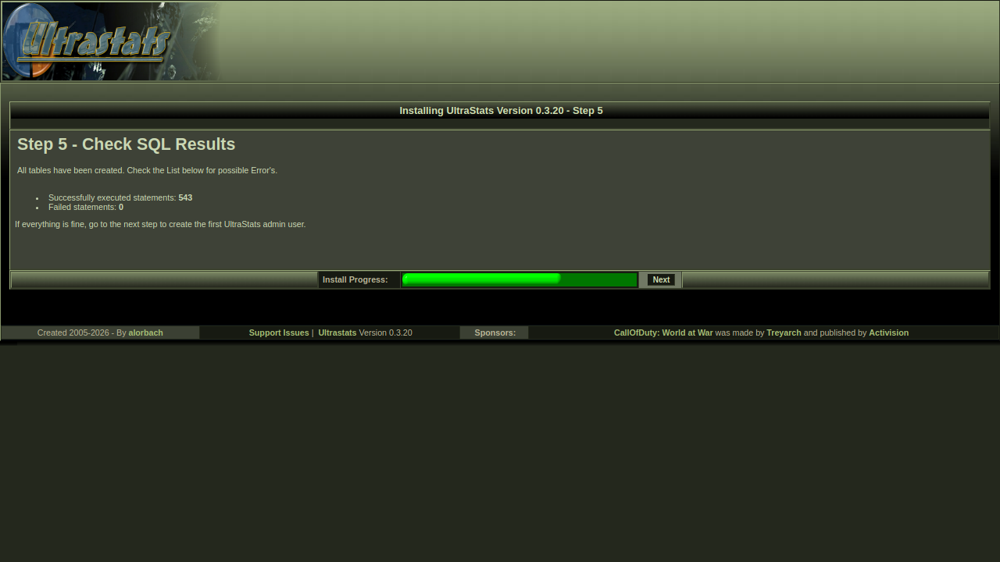
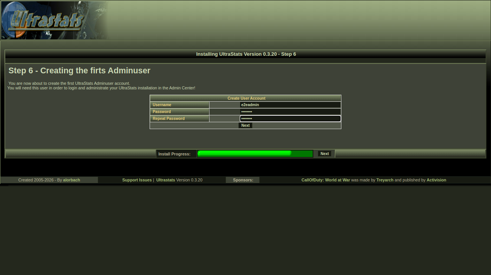
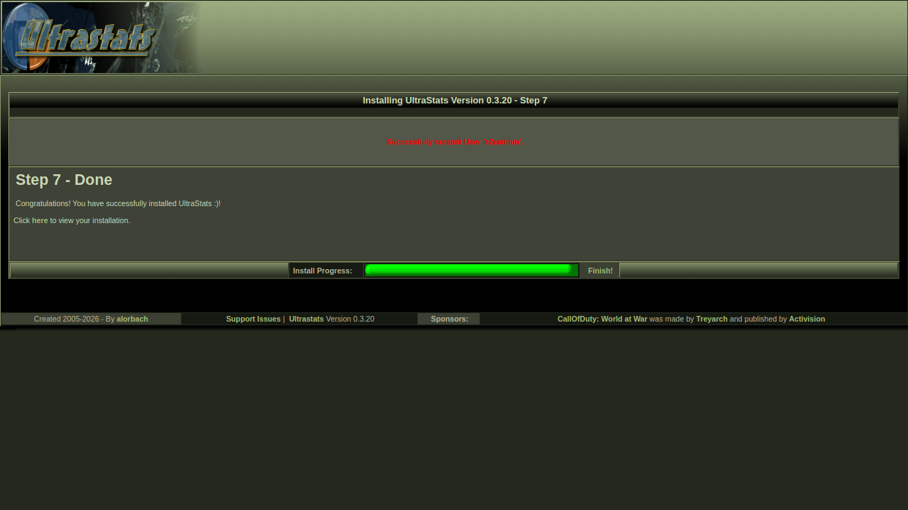

#### First admin actions after install

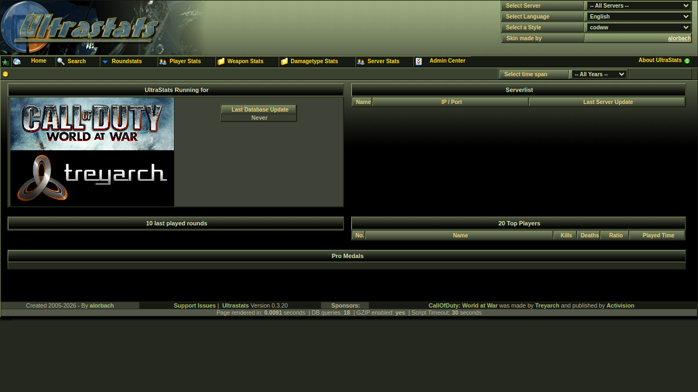
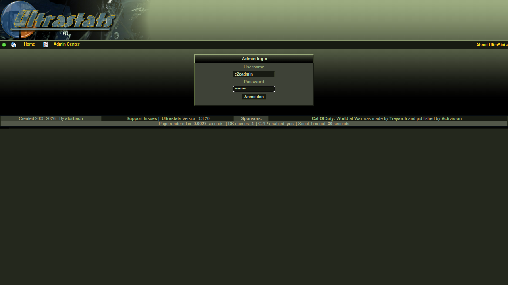
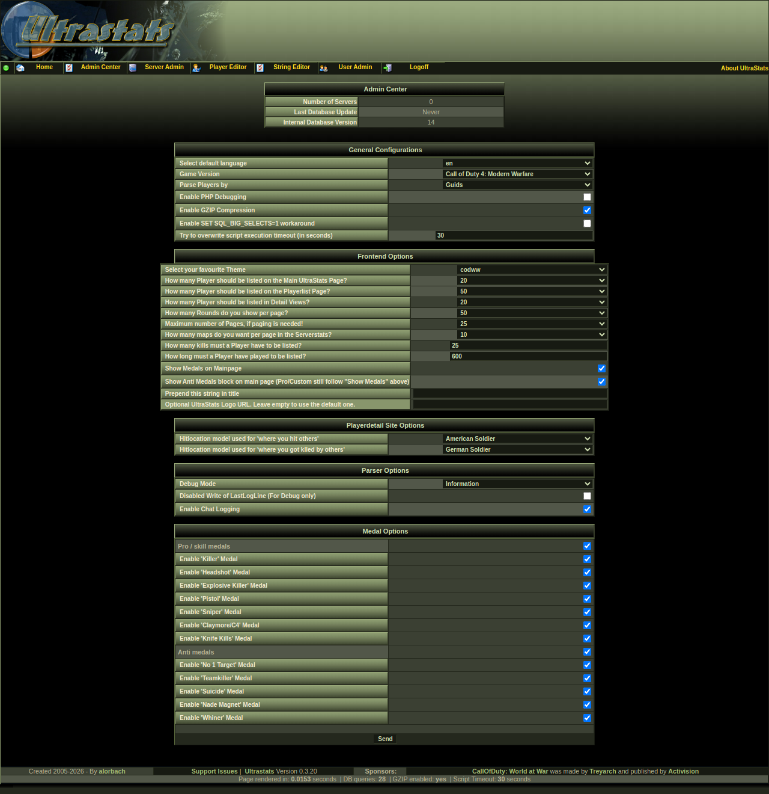

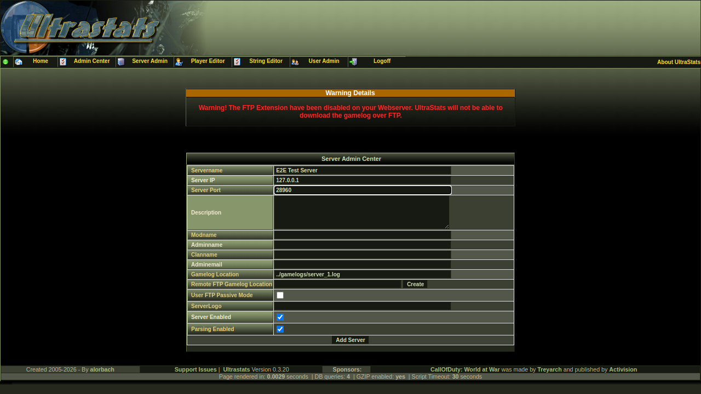
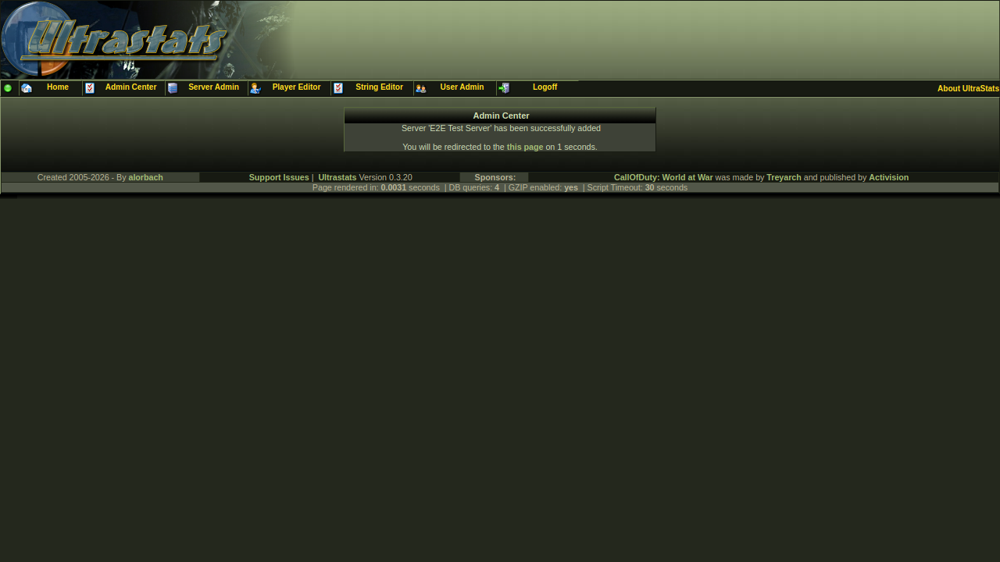
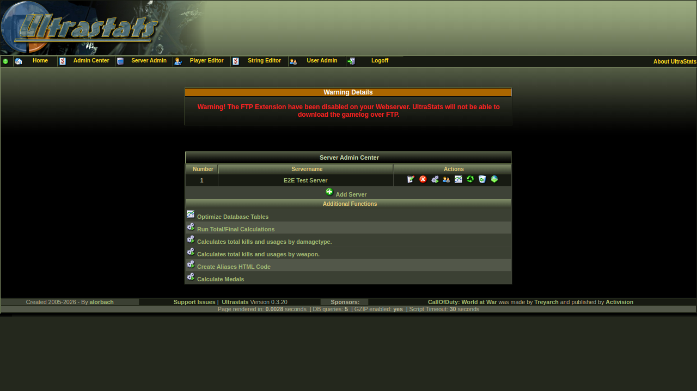
4. If successful, the front page may show **“No servers installed”** until you add a server. Open **Admin Center**, sign in, and add a server.  
5. In **Server admin**, use **Add server**. The important field is **gamelog location**—a path the **web server** can read. If the log is inside the deployed app's `gamelogs/` folder, use a path like `gamelogs/server_1.log` or `gamelogs/cod4_normal.log`. If the game server and web server are the same machine, you can also set a full filesystem path.  
6. If you **do not** need remote download, you can ignore FTP. Otherwise, open **Edit** on the server; use the helper for **Remote FTP gamelog location**, e.g. `ftp://username@127.0.0.1/.callofdutyww/main/Server1_mp.log`. Use the download control in the admin UI when ready; the parser **appends** to existing log files under the deployed app root unless you configured another readable path.  
7. **Run the parser** from the server row (or CLI scripts in the deployed `contrib/` folder if the web request times out on large logs).  
8. Run **total / final** calculations (medals, aliases, etc.) as documented for your version.  
9. You should then see stats on the site.  

## Problems

If something breaks, use your project **issue tracker**; old public forums may no longer exist.
